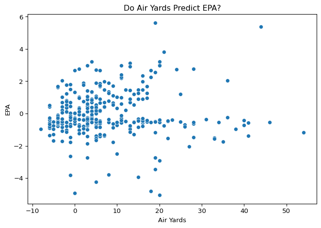
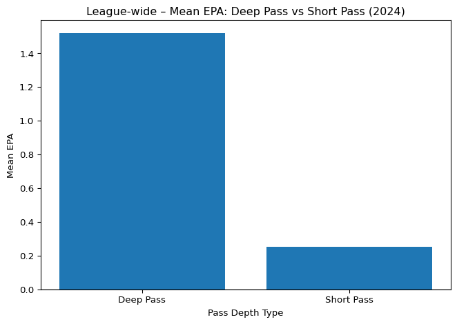
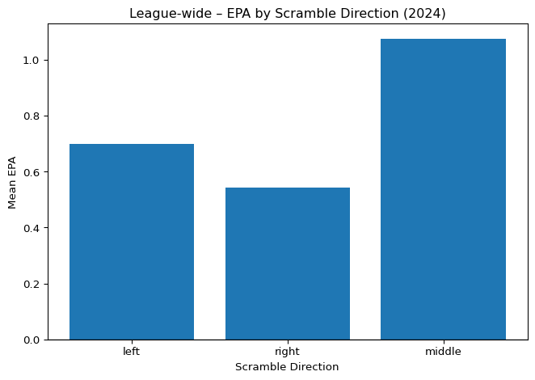
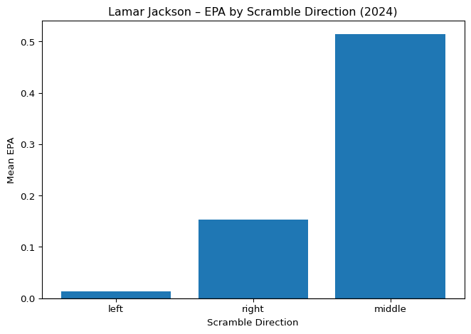

# NFL EPA Analysis – Data Wrangling & Exploratory Modeling


## This project explores how different play characteristics in the NFL relate to Expected Points Added (EPA). Using publicly available 2024 play-by-play data, the analysis investigates whether “riskier” plays—such as deep passes or specific scramble directions—are associated with higher EPA.

- Data loading and basic wrangling  
- Text-based feature creation from play descriptions  
- Simple statistical modeling (OLS and logistic regression)  
- Exploratory visualizations  
- Player-level breakdowns for Lamar Jackson and Josh Allen

### Data

The primary dataset is a 2024 NFL play-by-play file:

- `nfl_pbp_2024_full.csv`

It includes play descriptions, EPA, air yards, and other play-level
information.

``` python
import pandas as pd
import statsmodels.api as sm
import seaborn as sns
import matplotlib.pyplot as plt

pbp = pd.read_csv('c:/Users/asaar/Downloads/Machine Learning/nfl_pbp_2024.csv')

pbp.head()
```

<div>
<style scoped>
    .dataframe tbody tr th:only-of-type {
        vertical-align: middle;
    }
&#10;    .dataframe tbody tr th {
        vertical-align: top;
    }
&#10;    .dataframe thead th {
        text-align: right;
    }
</style>

|  | play_id | game_id | old_game_id | home_team | away_team | season_type | week | posteam | posteam_type | defteam | ... | out_of_bounds | home_opening_kickoff | qb_epa | xyac_epa | xyac_mean_yardage | xyac_median_yardage | xyac_success | xyac_fd | xpass | pass_oe |
|----|----|----|----|----|----|----|----|----|----|----|----|----|----|----|----|----|----|----|----|----|----|
| 0 | 1 | 2024_01_ARI_BUF | 2024090801 | BUF | ARI | REG | 1 | NaN | NaN | NaN | ... | 0 | 0 | 0.000000 | NaN | NaN | NaN | NaN | NaN | NaN | NaN |
| 1 | 40 | 2024_01_ARI_BUF | 2024090801 | BUF | ARI | REG | 1 | ARI | away | BUF | ... | 0 | 0 | 0.257819 | NaN | NaN | NaN | NaN | NaN | NaN | NaN |
| 2 | 61 | 2024_01_ARI_BUF | 2024090801 | BUF | ARI | REG | 1 | ARI | away | BUF | ... | 0 | 0 | -0.200602 | NaN | NaN | NaN | NaN | NaN | 0.456761 | -45.676103 |
| 3 | 83 | 2024_01_ARI_BUF | 2024090801 | BUF | ARI | REG | 1 | ARI | away | BUF | ... | 0 | 0 | 2.028874 | 1.345418 | 9.321221 | 8.0 | 0.509778 | 0.363807 | 0.576656 | 42.334431 |
| 4 | 108 | 2024_01_ARI_BUF | 2024090801 | BUF | ARI | REG | 1 | ARI | away | BUF | ... | 0 | 0 | 0.754242 | 0.882798 | 5.783560 | 4.0 | 0.668478 | 0.255140 | 0.426443 | 57.355690 |

<p>5 rows × 372 columns</p>
</div>

### Methods

Initial Exploration: Air Yards and EPA

We first examine whether air yards (a proxy for “riskier” throws) are
associated with EPA.

<div id="fig-air-yards-epa">



Figure 1: Relationship between air yards and EPA for all 2024 plays.

</div>

We fit a simple OLS model with air yards as the outcome and EPA as the
predictor to quantify the relationship.

``` python
risky_ols = sm.formula.ols("air_yards ~ epa", data=pbp).fit()
risky_ols.summary()
```

|                   |                  |                     |         |
|-------------------|------------------|---------------------|---------|
| Dep. Variable:    | air_yards        | R-squared:          | 0.002   |
| Model:            | OLS              | Adj. R-squared:     | -0.001  |
| Method:           | Least Squares    | F-statistic:        | 0.5700  |
| Date:             | Thu, 11 Dec 2025 | Prob (F-statistic): | 0.451   |
| Time:             | 00:09:11         | Log-Likelihood:     | -1213.8 |
| No. Observations: | 322              | AIC:                | 2432\.  |
| Df Residuals:     | 320              | BIC:                | 2439\.  |
| Df Model:         | 1                |                     |         |
| Covariance Type:  | nonrobust        |                     |         |

OLS Regression Results

|           |        |         |        |          |         |         |
|-----------|--------|---------|--------|----------|---------|---------|
|           | coef   | std err | t      | P\>\|t\| | \[0.025 | 0.975\] |
| Intercept | 7.7521 | 0.587   | 13.216 | 0.000    | 6.598   | 8.906   |
| epa       | 0.3114 | 0.412   | 0.755  | 0.451    | -0.500  | 1.123   |

|                |        |                   |          |
|----------------|--------|-------------------|----------|
| Omnibus:       | 86.184 | Durbin-Watson:    | 1.929    |
| Prob(Omnibus): | 0.000  | Jarque-Bera (JB): | 174.168  |
| Skew:          | 1.392  | Prob(JB):         | 1.51e-38 |
| Kurtosis:      | 5.286  | Cond. No.         | 1.42     |

<br/><br/>Notes:<br/>[1] Standard Errors assume that the covariance matrix of the errors is correctly specified.

Interpretation (summary): The fitted model suggests there is little to
no meaningful linear relationship between EPA and air yards league-wide.

### Text-Based Features: Deep vs Short Passes

We construct indicators for pass depth using the natural language in the
play description field.

``` python
pbp["desc_lower"] = pbp["desc"].str.lower()

pbp["pass_deep_all"] = pbp["desc_lower"].str.contains("pass deep")
pbp["pass_short_all"] = pbp["desc_lower"].str.contains("pass short")

pbp[["desc_lower", "pass_deep_all", "pass_short_all"]].head()
```

<div>
<style scoped>
    .dataframe tbody tr th:only-of-type {
        vertical-align: middle;
    }
&#10;    .dataframe tbody tr th {
        vertical-align: top;
    }
&#10;    .dataframe thead th {
        text-align: right;
    }
</style>

|  | desc_lower | pass_deep_all | pass_short_all |
|----|----|----|----|
| 0 | game | False | False |
| 1 | 2-t.bass kicks 65 yards from buf 35 to end zon... | False | False |
| 2 | (15:00) 6-j.conner up the middle to ari 33 for... | False | False |
| 3 | (14:27) 1-k.murray pass short left to 6-j.conn... | False | True |
| 4 | (13:43) (shotgun) 1-k.murray pass short middle... | False | True |

</div>

To understand whether higher EPA is associated with plays that are
labeled “deep,” we fit a logistic regression:

``` python
pbp["deep_yes"] = pbp["pass_deep_all"].astype(int)

deep_logit = sm.formula.logit("deep_yes ~ epa", data=pbp).fit()
deep_logit.summary()
```

    Optimization terminated successfully.
             Current function value: 0.106777
             Iterations 8

We can also compare the mean EPA of deep vs short passes:

``` python
pbp_pass_depth = pbp[(pbp["pass_deep_all"]) | (pbp["pass_short_all"])].copy()

pass_depth_results_all = {
"Deep Pass": pbp_pass_depth.loc[pbp_pass_depth["pass_deep_all"], "epa"].mean(),
"Short Pass": pbp_pass_depth.loc[pbp_pass_depth["pass_short_all"], "epa"].mean(),
}

pass_depth_df_all = (
pd.DataFrame.from_dict(pass_depth_results_all, orient="index", columns=["mean_epa"])
.rename_axis("pass_type")
.reset_index()
)

pass_depth_df_all

#| label: fig-pass-depth-epa
#| fig-cap: "League-wide mean EPA for deep vs short passes."
#| echo: false

plt.figure()
plt.bar(pass_depth_df_all["pass_type"], pass_depth_df_all["mean_epa"])
plt.title("League-wide – Mean EPA: Deep Pass vs Short Pass (2024)")
plt.ylabel("Mean EPA")
plt.xlabel("Pass Depth Type")
plt.axhline(0, color="black", linewidth=1)
plt.tight_layout()
plt.show()
```



### Scramble Direction – League-Wide

We classify scramble direction using three patterns in the play
descriptions:

“scrambles left”

“scrambles right”

“scrambles up the middle”

``` python
pbp["scramble_left_all"] = pbp["desc_lower"].str.contains("scrambles left")
pbp["scramble_right_all"] = pbp["desc_lower"].str.contains("scrambles right")
pbp["scramble_middle_all"] = pbp["desc_lower"].str.contains("scrambles up the middle")

pbp_scrambles = pbp[pbp["desc_lower"].str.contains("scrambles")].copy()

scramble_results_all = {
"left": pbp_scrambles.loc[pbp_scrambles["scramble_left_all"], "epa"].mean(),
"right": pbp_scrambles.loc[pbp_scrambles["scramble_right_all"], "epa"].mean(),
"middle": pbp_scrambles.loc[pbp_scrambles["scramble_middle_all"], "epa"].mean(),
}

scramble_df_all = (
pd.DataFrame.from_dict(scramble_results_all, orient="index", columns=["mean_epa"])
.rename_axis("scramble_direction")
.reset_index()
)

scramble_df_all

#| label: fig-scramble-league
#| fig-cap: "League-wide mean EPA by scramble direction (2024)."
#| echo: false

plt.figure()
plt.bar(scramble_df_all["scramble_direction"], scramble_df_all["mean_epa"])
plt.title("League-wide – EPA by Scramble Direction (2024)")
plt.ylabel("Mean EPA")
plt.xlabel("Scramble Direction")
plt.axhline(0, color="black", linewidth=1)
plt.tight_layout()
plt.show()
```



### Player-Level Analysis

In the second half of the project, we focus on two quarterbacks: Lamar
Jackson and Josh Allen. For each quarterback, we:

Filter the play-by-play data using a name identifier in desc_lower

Build scramble direction flags

Build deep vs short pass indicators

Compute mean EPA for each category and visualize the results

Below is a representative example for one quarterback (Lamar Jackson);
the code for Josh Allen follows the same structure in the main script.

``` python
lamar = pbp[pbp["desc_lower"].str.contains("l.jackson")].copy()

lamar["scramble_left"] = lamar["desc_lower"].str.contains("scrambles left")
lamar["scramble_right"] = lamar["desc_lower"].str.contains("scrambles right")
lamar["scramble_middle"] = lamar["desc_lower"].str.contains("scrambles up the middle")

lamar_scrambles = lamar[lamar["desc_lower"].str.contains("scrambles")].copy()

results_lamar_scramble = {
"left": lamar_scrambles.loc[lamar_scrambles["scramble_left"], "epa"].mean(),
"right": lamar_scrambles.loc[lamar_scrambles["scramble_right"], "epa"].mean(),
"middle": lamar_scrambles.loc[lamar_scrambles["scramble_middle"], "epa"].mean(),
}

results_lamar_scramble

#| label: fig-lamar-scramble
#| fig-cap: "Lamar Jackson – mean EPA by scramble direction (2024)."
#| echo: false

lamar_scramble_df = (
pd.DataFrame.from_dict(results_lamar_scramble, orient="index", columns=["mean_epa"])
.rename_axis("scramble_direction")
.reset_index()
)

plt.figure()
plt.bar(lamar_scramble_df["scramble_direction"], lamar_scramble_df["mean_epa"])
plt.title("Lamar Jackson – EPA by Scramble Direction (2024)")
plt.ylabel("Mean EPA")
plt.xlabel("Scramble Direction")
plt.axhline(0, color="black", linewidth=1)
plt.tight_layout()
plt.show()
```



A similar workflow is applied for deep vs short passes and replicated
for Josh Allen in the .py script.

### Discussion

Overall, the analysis suggests:

Air yards alone are not strongly predictive of EPA, despite being an
intuitive proxy for risk.

Deep passes tend to be associated with higher EPA compared to short
passes when classified using play descriptions.

Scramble direction matters for both league-wide plays and specific
quarterbacks, with certain directions yielding higher average EPA.

Player-level breakdowns (Lamar Jackson vs Josh Allen) highlight
stylistic differences and can inform both scouting and strategic
decision-making.
